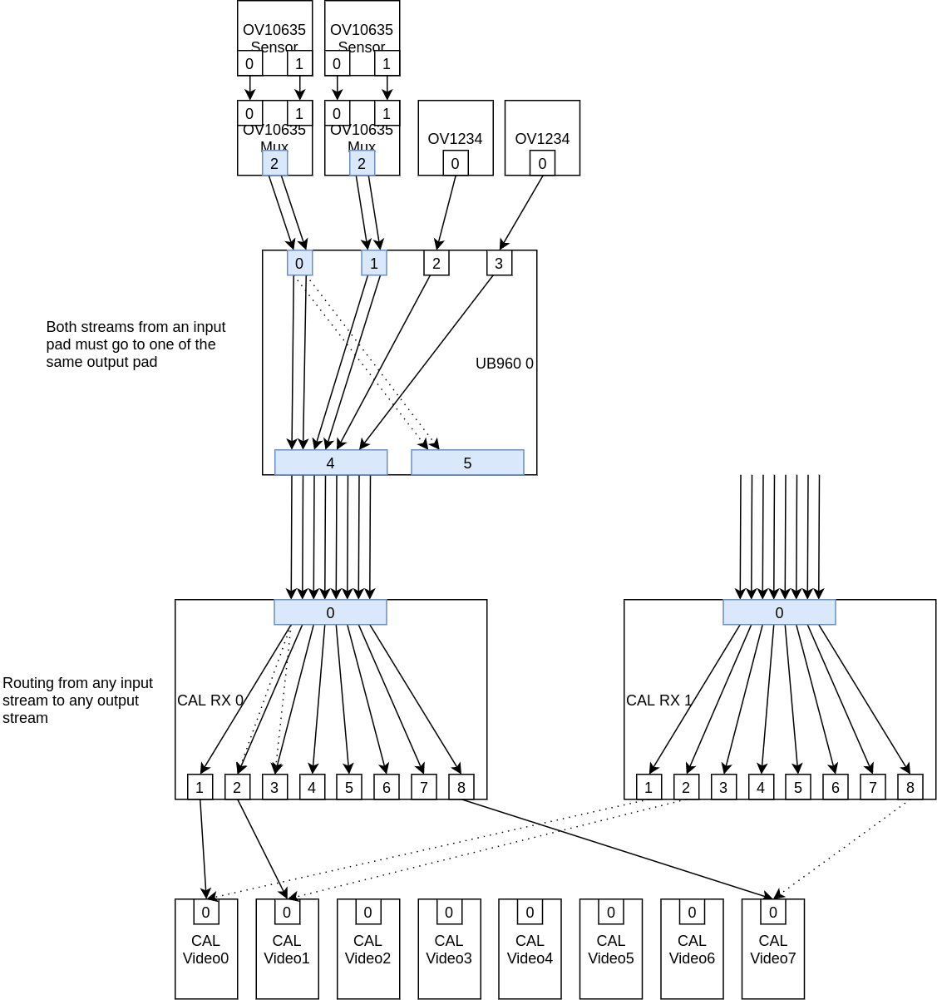

## Git trees

The kernel tree:

git://git.kernel.org/pub/scm/linux/kernel/git/tomba/linux.git multistream-milestone-2

DT Overlay tree:

git://git.kernel.org/pub/scm/linux/kernel/git/tomba/linux-dt.git multistream-milestone-2

kms++ tree:

git://github.com/tomba/kmsxx.git multistream-milestone-2

## V4L2 Device

This is the main V4L2 device that, in our case, matches the platform device.

## V4L2 Subdevice

V4L2 subdevices (subdev) represent pieces of the capture pipeline. Sometimes a subdev is a single HW component, e.g. a sensor, but a subdev can also be a part of a HW block when the division makes sense. Subdevs are accessed via /dev/v4l-subdevX.

## V4L2 Video Device

Each video device represents a DMA engine which can capture a single stream. Video devices are accessed via /dev/videoX.

## Media Device

A device associated with the V4L2 device, used to manage the links between Media Entities. The media device is accessed via /dev/mediaX.

## Media Entity

Video devices and subdevices are represented as Media Entitites under Media Device.

## Media Pad

Media Pad is a single sink or source (input or output) for a Media Entity. Media Entity can have many sink and source pads.

## Media Link

Media Links link together pads between Media Entities. Media Link is not a stream, although in many cases only a single stream goes through a single link. In many cases Media Links cannot be changed by the userspace, but sometimes they can be enabled/disabled.

## Routing

Routing refers to subdev internal logical routing. Routing is essentially a list of tuples: (sink-pad, sink-stream, source-pad, source-stream). Sink and source pads tell the pads of the entity where the stream comes in and where it goes out. The "sink-stream" and "source-stream" are stream identifiers, used to tell the streams apart. The stream identifiers can be any numbers, i.e. they don't have any connection to virtual channel IDs or such. However, the stream identifiers must match between the source entity's source-stream and sink entity's sink-stream.

Using the routing information you can follow the stream from one end of the pipeline to the other. In some cases the routing is static, but usually the userspace must configure the routing based on the use case.

Note that routing is often quite dynamic and vague. If you think about the DS90UB960, it has 4 sink pads and 2 source pads. How many streams can there be? It is undefined, as there's no single definition of what a stream is. Consider a pixel stream from a sensor. You could say that it's a single stream. But you could also say that the first 3 lines are one stream (e.g. they might contain metadata) and the rest would be another stream. Or, going to the silly extremes, you could say that each line is a separate stream. But obviously there's no point in arbitrarily splitting pixel data into separate streams, especially if the HW doesn't have any specific support for it.

At the source-side of the pipeline it's usually easy to describe the streams: often there's just a single pixel stream, or a pixel stream and a metadata stream. With a CSI-2 camera, the pixel stream could be transferred in VC0, and the metadata in VC1. Or both could be transferred in VC0, using different CSI-2 datatypes. But CSI-2 could also easily be used to transfer 8 streams: all four VCs containing both pixel data and metadata using separate datatypes.

So, going back to DS90UB960, when DS90UB960 receives CSI-2 data to one of its sink ports, how many streams are there? The driver cannot know, so the userspace must tell it via the set_routing functionality.

## Frame desc

Frame descriptor is kernel internal data, provided via get_frame_desc from v4l2_subdev_pad_ops. get_frame_desc can be used by a subdev to ask the source subdev the details about the streams it is sending. While the routing described the logical routes, without direct relation to actual HW, the frame desc describes actual details, such as virtual channel and datatype for CSI-2.

The frame descs must match the routing: If routing says that the source pad 2 of a subdev has two streams, with stream identifiers 2 and 3, then the frame desc for pad 2 must contain details for streams 2 and 3.

## Concerning Pad Configuration

In current upstream kernel the pads contain configuration such as size and pixel format. These are used to configure the pipeline.

When a pad can contain multiple streams, the above doesn't anymore make sense as there's no single configuration for a pad. This aspect of multistream support is still under work. My current implementation handles this so that the pad based configuration functions (e.g. v4l2_subdev_pad_ops.set_routing) is either not implemented or will return -ENOIOCTLCMD if multistream is supported.

However, we still need to know the configuration for a single stream. The way to find out the configuration for a stream is to follow the stream (using routing) until a non-multiplexed pad is found, which contains the configuration. Note that you can follow the stream to either direction, sourceward or sinkward, and you should find the same configuration on both ends.

Jfyi, there is another idea on how this could be handled, which is pad+stream based configuration. Instead of configuring a pad, the userspace would always configure a pad+stream tuple.

## Multistream-enabled subdev driver

The code to support multistreaming depends on the HW, but there are a some clear items that needs to be taken care of:

- Implement routing support. get_routing and set_routing must be implemented for v4l2_subdev_pad_ops, and has_route for media_entity_operations. In some cases the routing cannot be changed, and only get_routing is enough.

- Frame desc support. get_frame_desc must be implemented.

## Multistream-enabled SoC capture driver

The implementation depends on the design, but most likely frame desc support is not needed (there's no sink entity needing that information). Routing support is needed, and the driver should create as many video devices as there are way to capture separate streams. CAL has 8 DMA engines, so CAL driver creates 8 video devices. If the HW can handle arbitrary amount of streams, perhaps a kernel parameter can define the amount of video devices created.

For CAL the design is:
- V4L2 device representing the platform device
- 8 video devices, representing the DMA engines
- 2 CameraRX subdevices representing the CSI-2 receivers

Each of the CameraRX subdevs have a single sink pad and 8 source pads. To capture a stream, a video device has to be linked to a source pad on either of the RX subdevs. The routing in the subdev then needs to be changed to route a single stream to that pad.

Note: CAL has 8 DMA engines, but both RX subdevs could produce 8 streams, so 16 in total. Thus not all possible streams can be captured.

## Metadata Capture

Video devices support metadata capture separetely from normal pixel data capture. There are separate functions to implement for metadata, e.g. v4l2_ioctl_ops.vidioc_g_fmt_meta_cap. In a way, a video device can either be in a metadata mode or pixel data mode. When no buffers have been queued to the video device, it's (kind of) in both modes, but when a buffer of either metadata type or pixel data type has been queued, the mode is locked until all the buffers have been dequeued.

This functionality can be implemented using a single vb2_queue, but changing the type of the queue (with vb2_queue_change_type) in the pixel or metadata set_fmt call. This means that the last set_fmt call defines the "mode", and when the first buffer is queued, the mode is locked.

## Concerning user space

- The userspace doesn't see or configure virtual channel IDs or datatypes, they are internal to the kernel.
- The userspace must configure a "stream", which starts from a non-multiplexed pad in a sensor, and goes to a video device.

There is no single way to manage complex capture pipelines. Writing generic code that would handle all kinds of HW setups is not possible.

My test application does something along these lines:

The app contains definitions for the streams. These are mostly hardcoded details for the HW setup I have. A stream definition contains the entities, source and sink pads, stream identifiers and possible pad configurations which together create a single stream. And together all the definitions describe all the streams we are capturing.

Based on the definitions, the app does the following:

- Disable all links (to ensure nothing extra is kept enabled)
- Use the stream definitions to:
  - Enable links between entities.
  - Set routes for subdevs
  - Set pad configurations

## Userspace tools

No changes wrt. routing has yet been made to the standard v4l tools. To use multistream support you have to write an application using the new features.

For my work I have used tools I'm most familiar with: kms++ library with python bindings. I have added C++ classes for the required v4l features, and added python bindings for them. I have a small python application (py/tests/cam.py) that sets up the pipeline for 2 cameras, a pixel and metadata stream from each, and shows the data on screen using four DSS planes (Note: this only works on DRA76, as AM6 has only 2 planes. Note 2: DRA76 has 3 planes that support YUV formats, so one of the planes uses RGB565 mode for showing YUV data).

Most of this work is not polished at all, e.g. errors may crash the app, etc.

The standard v4l2-ctl and media-ctl tools can be used to test or change many things in the pipeline, so even if they are missing routing support they can still be used as part of testing.

I also have a small python script (mc-print.py) to print media entities and links. It's a bit similar to "media-ctl -p", but shows only the enabled parts of the media tree, which I find much more readable.

## About the HW setup

Two platforms have been used: 1) DRA76 EVM + fusionboard, and 2) AM6 EVM + UB960 EVM. In many ways the setups are very similar. The main difference is that fusionboard has two UB960 ICs, each connected to a CSI-2 connector in DRA76, whereas UB960 EVM has a single UB960.

The camera modules are UB913 with OV10635, which is a parallel sensor. There is no metadata. Metadata is simulated via UB960 configuration: UB960 can be configured to use metadata-datatype for the first 1 to 3 lines of pixel data. To enable this, hacks have been added to both the OV10635 and the UB960 drivers.

A thing to notice is that (as mentioned in emails) CAL considers each metadata packet as a "frame", and produces WDMA START/END interrupts for each. For this reason I have been using UB960 configuration which extracts a single line of metadata. This way each "real" frame will produce 1 buffer of metadata (containing one line) and 1 buffer of pixel data (height - 1). We need to study and test CAL DMA to capture more metadata packets per frame in a sensible way.

OV10635 is a black box with lacking documentation, but at least I have gotten the relevant resolutions to work (1280x720@30 and 752x480@30).

## How to add multistream support to J7

The previous sections should have covered most of the topics needed to implement multistream & embedded data support on J7.

## The Kernel WIP branch

Brief descriptions about patches in the WIP branch. Each comment refers to commits listed above the comment.

```
40827201eac6 Revert "mfd: syscon: Don't free allocated name for regmap_config"
16f900e2024d media: ov5640: adjust htot
75f194c3c75c don't KASANize module.o
234c478ac9d4 gpio: fix NULL-deref-on-deregistration regression
8986b55558f6 gpio: fix gpio-device list corruption

Misc patches/fixes, unrelated to this work.

8475a1a99e62 dra76-evm.dts: remove ov5640
6d4f2ffc846d am65-evm.dts: remove ov5640

OV5640 was included in the EVM dts files, which is incorrect. Remove it from the dts so that we can add different configurations via DT overlays.

c80b23884988 media: entity: Use pad as a starting point for graph walk
164bbb0e44b3 media: entity: Use pads instead of entities in the media graph walk stack
ae8c03c8cd14 media: entity: Walk the graph based on pads
15f593eeb463 v4l: mc: Start walk from a specific pad in use count calculation
9ab73434e912 media: entity: Add iterator helper for entity pads
939774a1459f media: entity: Move the pipeline from entity to pads
f454c0e26678 media: entity: Use pad as the starting point for a pipeline
2420fc0f14f6 media: entity: Add has_route entity operation
a1ed3a83c769 media: entity: Add media_entity_has_route() function
7a1abc3723a2 media: entity: Use routing information during graph traversal
1da2cb5acfa3 media: entity: Skip link validation for pads to which there is no route to
c7969caf80c2 media: entity: Add an iterator helper for connected pads
1d121b6a0a18 media: entity: Add only connected pads to the pipeline
7d507e103325 media: entity: Add debug information in graph walk route check
6a9d6762709b v4l: Add bus type to frame descriptors
f073809c8109 v4l: Add CSI-2 bus configuration to frame descriptors
81816e164b60 v4l: Add stream to frame descriptor
31a3a8dd1cb6 v4l: subdev: Add [GS]_ROUTING subdev ioctls and operations
f2c9e541977d media: Documentation: Add GS_ROUTING documentation
d8a900fd3764 v4l: subdev: Take routing information into account in link validation
b4a2eabaaa75 v4l: mc: Add an S_ROUTING helper function for power state changes
4a5efc88a4e3 fixup! media: entity: Use pad as the starting point for a pipeline
58a6d2f4abcd media: ti-vpe: cal: Switch to new media_pipeline_(start|stop)() API
c103bd273a1b FIX: v4l: subdev: Add [GS]_ROUTING subdev ioctls and operations

Old patches which attempted adding multistream support.

7d6e46021b44 dt-bindings: media: Add bindings for OmniVision OV1063x sensors
bc9545787b7a media: i2c: Add OV1063x sensor driver
6643f02f8335 ov10635: hardcode pclk to 96MHz
f7fa034df4bb ov10635: hackfix 96 MHz pclk by commenting out writes to unknonown regs
c9902dbe7bfa ov10635: add debug prints
4cae46985ba0 ov10635: HACK: fake metadata with sensor & mux subdevs

ov10635 sensor driver, with hacks to make it use 96 MHz pclk (required by UB913), and to add "fake" stream for one line of metadata.

540fd70d0184 i2c: core: let adapters be notified of client attach/detach
bf780dffdcb4 i2c: add I2C Address Translator (ATR) support

Old patches for ATR, an attempt to support the fpdlink i2c functionality.

b63b48d74a32 include: dt-bindings: add ds90ub9xx.h (for GPIOs)
6cb961a8c254 Add DS90UB913 driver
bd5e006fb5d3 Add DS90UB960 driver
8ce44f39afb9 ub960: add V4L2_CID_LINK_FREQ
f63a84baf8ed ub960: routing, frame_desc, embedded data...

Hack UB913 and UB960 drivers with multistream support.

de044880bb72 v4l2-subdev.h: increase V4L2_FRAME_DESC_ENTRY_MAX to 8
23b41bcef9b0 v4l2: add vb2_queue_change_type
1c46958b8ed3 FIX media_pipeline_start cleanup (squash to Sakari's patch)
dd3d38ea5d25 FIX: v4l2_subdev_link_validate: fix check for sink routes
a4c9b984dd23 mc-entity: debug print

V4L2 core patches to improve the multistream support.

12ecef1850d5 v4l: add META format

Add a fake metadata format. This needs more discussion: will there be a specific format for each specific metadata format, or more generic metadata formats which only describe how the data has to be handled, not what it actually contains.

538fe314bbf9 v4l core: v4l2_subdev_link_validate_get_format_dir (deep get-format)

A function to get pad format via following routes to a non-multiplexed pad.

2333d5fe4f91 media: ti-vpe: cal: remove unused cal_camerarx->dev field
35e4a03b803b media: ti-vpe: cal: rename "sensor" to "source"
98f2656b7187 media: ti-vpe: cal: move global config from cal_ctx_wr_dma_config to runtime resume
c61372115b90 media: ti-vpe: cal: use v4l2_get_link_freq
78e58dfa7cc8 media: ti-vpe: cal: add cal_ctx_prepare/unprepare
097171bfb1aa media: ti-vpe: cal: change index and cport to u8
af6bd348aafc media: ti-vpe: cal: Add PPI context
295afe25845a media: ti-vpe: cal: Add pixel processing context
62cd400d3910 media: ti-vpe: cal: rename cal_ctx->index to dma_ctx
e500361c8ab2 media: ti-vpe: cal: rename CAL_HL_IRQ_MASK
39ec192bb23d media: ti-vpe: cal: clean up CAL_CSI2_VC_IRQ_* macros
5a7e9c94f28e media: ti-vpe: cal: catch VC errors
4d236d64f7bc cal: fix timeout when stopping camerarx
fffdecccce21 media: ti-vpe: cal: disable ppi and pix proc at ctx_stop
78a2a714f7ee media: ti-vpe: cal: allocate pix proc dynamically
f61e8c70cedc media: ti-vpe: cal: add 'use_pix_proc' field
71025c9966b7 media: ti-vpe: cal: add cal_ctx_wr_dma_enable and fix a race
8e611f47a048 media: ti-vpe: cal: add vc and datatype fields to cal_ctx
8437106cbc2b media: ti-vpe: cal: fix cal_ctx_v4l2_register error handling
ba571b584cce media: ti-vpe: cal: set field always to V4L2_FIELD_NONE
2bf41840be6d media: ti-vpe: cal: fix typo in a comment
f206a59b0e63 media: ti-vpe: cal: add mbus_code support to cal_mc_enum_fmt_vid_cap
87d65151eb48 media: ti-vpe: cal: rename non-MC funcs to cal_legacy_*
d1baee1bc1d5 media: ti-vpe: cal: init ctx->v_fmt correctly in MC mode
0478e5bd8de0 media: ti-vpe: cal: remove cal_camerarx->fmtinfo
73fe1fe5b0b6 media: ti-vpe: cal: support 8 DMA contexts
56d1b861e5f6 media: ti-vpe: cal: tune irq handling
1a8ab49e0301 cal: dma irq work, trying to solve the race
f8f85bc8b93a media: ti-vpe: cal: add camerarx locking
f72c2aae50e6 media: ti-vpe: cal: add camerarx enable/disable refcounting
93ceb1b36413 pad num helpers

CAL patches slowly transforming the driver to support all 8 DMA engines and adding plumbing for multiple streams and metadata. Note that in theory the driver should function as before here (although I haven't tested for a while), and there should be no real change in behavior.

1a76bb8457c5 cal: metadata support

Add metadata capture support to CAL's video devices.

47c6c89b21cc multistream work

This is the (still hacky) patch that finally brings everything together, changing the driver to create 8 device nodes, adding routing support, and adding the multistream support.
```

## The DT overlay branch

The DT overlay tree contains overlays for both DRA76 and AM6. The overlays are very similar between the EVMs, but not the same.

- ov5640 - ov5640 support (i.e. the old dts functionality). Don't use with fpdlink.
- fpdlink - UB960 support. You need this and some of the camera overlays.
- fpdlink-cameraXXX - overlays to add cameras on top of fplink overlay. E.g. dra76-evm-fpdlink-camera-0-1.dtso adds a camera for dra76, connected on the second port (1) on the first (0) UB960 on the fusion board (fusion board has two UB960).

## The pic


